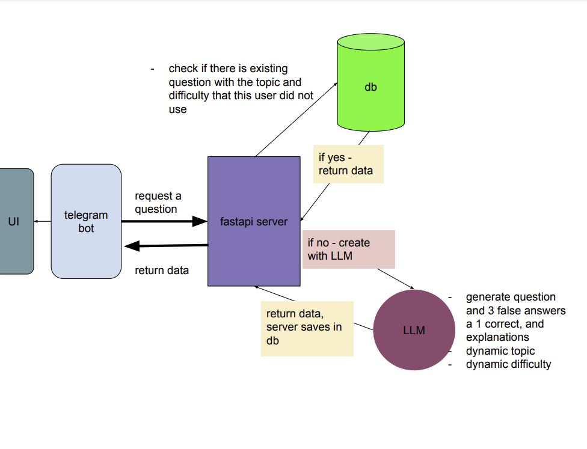

# code-genie-server

server for code genie

## Team Members
- Basel Amin
- Mohammad Shaheen
- Hasan Masalha
- Aya Abbas
- Shaden Hakim

## Product Goal 
This Code Genie server is the server for the Telegram bot named Code Genie. It designed to help graduates continue their studies and stay committed to practicing even after graduation

## General Architecture
This project includes the following main modules:
- Routes
- Database
- Business Logic: OpenAI



# folder structure for the project

    code-genie-server/
    │
    ├── server.py            # Entry point for the FastAPI server
    ├── routes/              # API routes # Define API endpoints
    ├── db/                  # Database-related files, Database models, CRUD operations, Database connection management
    ├── services/            # Business logic and services, Interactions with OpenAI API
    ├── utils/               # Utility functions
    ├── tests/               # Unit and integration tests, test_services.py
    ├── .env                 # Environment variables
    ├── requirements.txt     # Python dependencies
    └── README.md            # Project documentation

## Environment Variables


# Environment Variables (Explanation)

The following environment variables are stored in `.env`. Loading and usage of these variables is explained in [Usage](#environment-variables-usage)

- `MONGODB_USERNAME`: The username for MongoDB. Example: **root**
- `MONGODB_PASSWORD`: The password for MongoDB. Example: **1234**
- `MONGODB_HOST`: The host for MongoDB. Example: **localhost**
- `OPENAI_API_KEY`: The API Key used to make requests to the OpenAI API. Example: **sk-abcdefghijklmnopqrstuvwxyz1234567890abcd**
- `SERVER_URL`: The online server url. Example: **https://online-server-url.onrender.com/**

### Environment Variables - Usage

To load environment variables from a `.env` file in Python, you can use the `python-dotenv` package. Here’s how you can do it:

1. Save an `.env` file in your project. **WARNING**: make sure it is found in `.gitignore`. Save the above [Variables](#environment-variables-explanation) in the `.env` file using the exact provided names.

2. **Install the `python-dotenv` package** (if you haven’t already):

   ```sh
   pip install python-dotenv

   ```

3. A brief example on how to load a specific environment variable:

   ```python
   from dotenv import load_dotenv
   from globals import globals


   # Load the appropriate .env file
   if globals.env_status == "dev":
      load_dotenv('.env.dev')
   else:
      load_dotenv('.env.prod')

   mongodb_host = os.getenv('MONGODB_HOST')
   ```

## Command-Line Arguments

- `--env`: Specifies the environment to run the server in. Valid options are `dev` and `prod`. The default is `dev`.

## Running the Server

### Running in Development Environment

To run the server in the `dev` environment (default), use the following command:

```bash
python server.py
```

Or explicitly specify the environment:

```bash
python server.py --env dev
```

This will start the server on `127.0.0.1` (localhost) at port `8002`.

### Running in Production Environment

To run the server in the `prod` environment, use the following command:

```bash
python server.py --env prod
```

This will start the server on `127.0.0.1` (localhost) at port `8001`.
